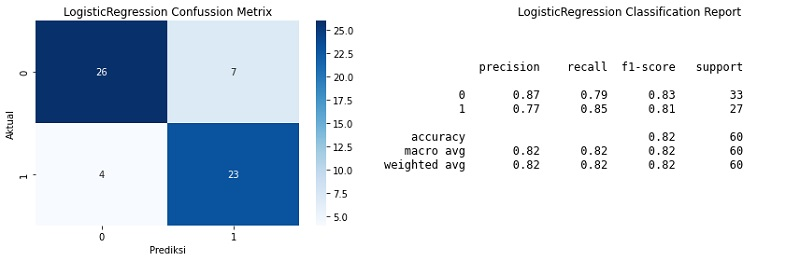
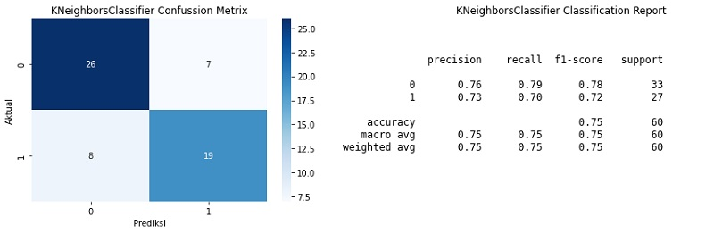
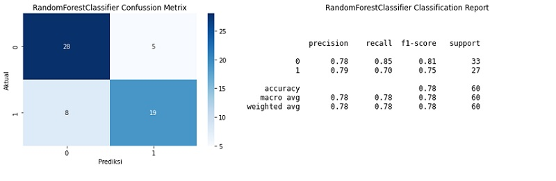
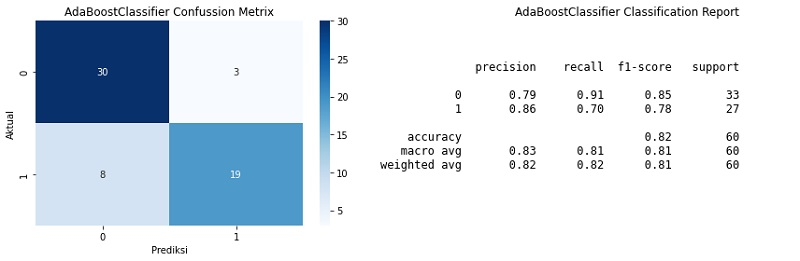
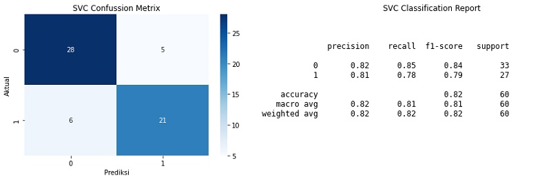
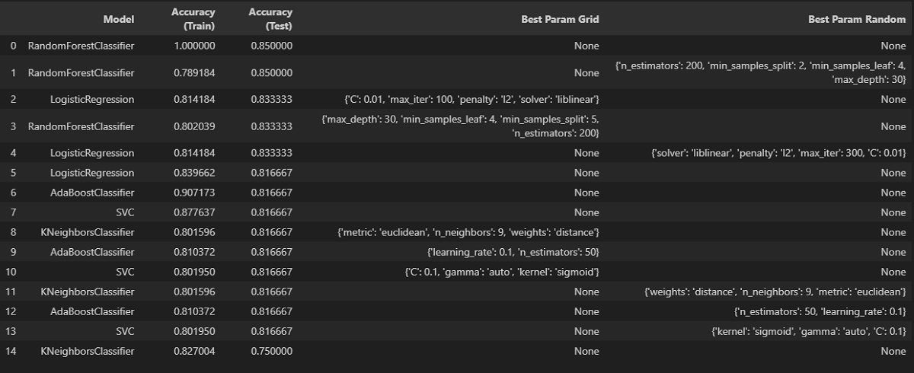

# Sebuah Studi Perbandingan Memprediksi Penyakit Jantung dengan Algoritma Machine Learning

Mengembangkan model machine learning untuk memprediksi risiko penyakit jantung secara akurat adalah tujuan proyek ini. Model ini dapat membantu dokter mengidentifikasi pasien yang berisiko tinggi dengan menganalisis data seperti usia, jenis kelamin, dan kadar kolesterol. Model ini dibuat dengan berbagai algoritma dan teknik untuk mengatasi ketidakseimbangan data dan diuji secara menyeluruh untuk memastikan akurasi yang tinggi. Menyediakan tenaga medis dengan alat bantu diagnosa yang efisien dan cepat adalah tujuan akhir.

## Dataset
Dataset yang digunakan adalah dataset Penyakit Jantung dari UCI Machine Learning Repository. Dataset ini berisi fitur-fitur berikut:
- Age
- Sex
- Chest Pain Type (cp)
- Resting Blood Pressure (trestbps)
- and others...

Anda dapat mengunduh dataset dari sini [UCI Machine Learning Repository](https://archive.ics.uci.edu/dataset/45/heart+disease)

## Model Performance
Model-model berikut ini yang telah diuji coba
1. Logistic Regression
2. KNeighbors Classifier
3. RandomForest Classifier
4. AdaBoost Classifier
5. Support Vector Classifier (SVC)

## Hasil performance

1. Logistic Regression
   
   

2. KNeighbors Classifier

   

3. RandomForest Classifier

   

4. AdaBoost Classifier

   

5. Support Vector Classifier (SVC)

   

   ### Hasil rekap akurasi performance + tuning hyperparameter menggunakan GridSearchCV dan RandomSearchCV

   

## Contributors
- Wira Dhana Putra
- Klik disini untuk melihat penjelasan lengkap beserta codenya -> [here](project_ml_heart_disease_final_3.ipynb)

## License
This project is licensed under the MIT License - see the [LICENSE.md](LICENSE.md) file for details.
