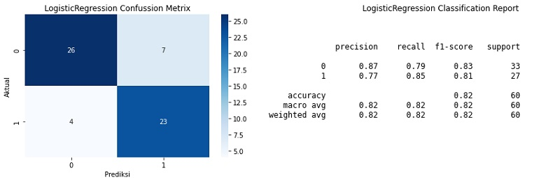
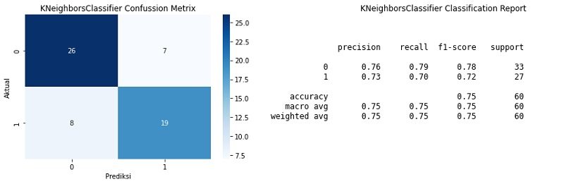
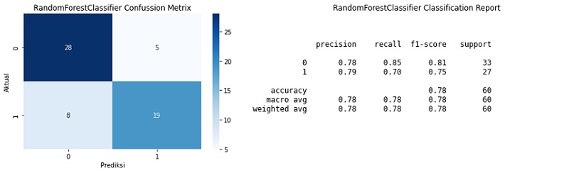
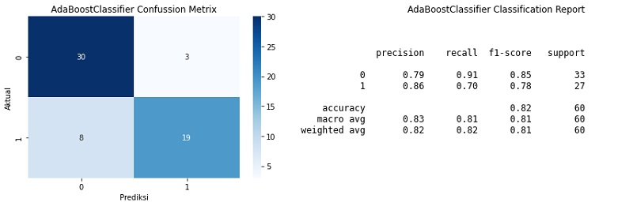
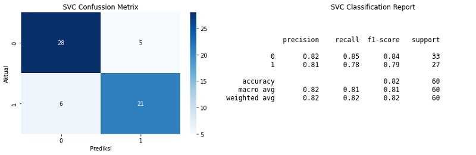
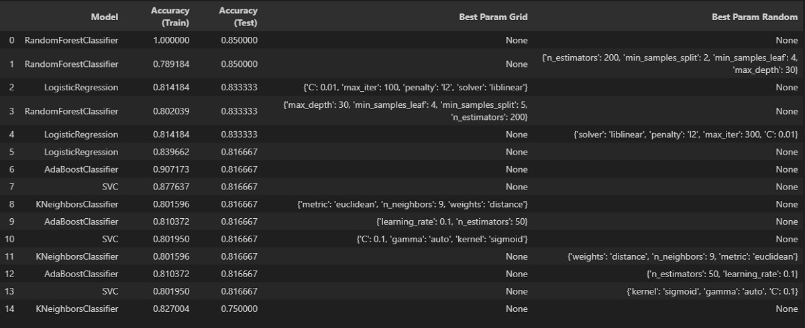

# 🫀 Sebuah Studi Perbandingan Memprediksi Penyakit Jantung dengan Algoritma Machine Learning

Proyek ini merupakan sebuah studi komparatif prediktif untuk memetakan risiko patologi kardiovaskular menggunakan dataset klinis terstruktur. Eksperimen ini mengevaluasi batas keputusan (*decision boundaries*) dari berbagai rumpun algoritma—mulai dari model parametrik linier hingga teknik *ensemble learning*—dengan fokus kritis pada analisis sensitivitas metrik medis dan evaluasi higienitas silsilah data (*data lineage*).

## 📊 Dataset & Fitur Klinis
Dataset eksternal yang digunakan bersumber dari **Heart Disease Dataset (Cleveland Database)** yang diinang oleh UCI Machine Learning Repository. Fitur utama yang dieksplorasi meliputi:
* `age` / `sex`: Profil demografi dasar pasien.
* `cp` (Chest Pain Type) / `trestbps` (Resting Blood Pressure): Indikator klinis kualitatif dan kuantitatif.
* `chol` (Serum Cholesterol) / `thalach` (Maximum Heart Rate Achieved): Metrik laboratorium kardiovaskular.

Dataset resmi dapat diakses secara terbuka melalui tautan berikut: [UCI Machine Learning Repository](https://archive.ics.uci.edu/dataset/45/heart+disease).

---

## ⚙️ Model Performance Evaluation
Model-model di bawah ini dievaluasi menggunakan konfigurasi arsitektur dasar dan optimasi *hyperparameter* (GridSearchCV & RandomizedSearchCV):
1. **Logistic Regression** (Optimasi Regularisasi Ridge/L2)
2. **K-Neighbors Classifier** (Klasterisasi Berbasis Jarak Euclidean)
3. **RandomForest Classifier** (Bagging Ensemble)
4. **AdaBoost Classifier** (Sequential Boosting Framework)
5. **Support Vector Classifier / SVC** (Maximal Margin Hyperplane)

### Dokumen Visual Performa (Confusion Matrix)

1. **Logistic Regression**

2. **KNeighbors Classifier**

3. **RandomForest Classifier**

4. **AdaBoost Classifier**

5. **Support Vector Classifier (SVC)**

### Hasil Rekap Akurasi Performa + Tuning Hyperparameter

---

## ⚠️ Post-Mortem Analysis & Data Leakage Review

Berdasarkan hasil rekapitulasi performa di atas, model **Random Forest** mencatatkan skor akurasi pelatihan yang sempurna (**1.00 / 100%**), namun mengalami penurunan performa drastis saat diuji pada partisi pengujian (**0.816**). 

**Identifikasi Kegagalan Batas Validasi:**
Secara retrospektif, anomali ini dikonfirmasi sebagai manifestasi dari **Data Leakage (Kebocoran Data)**. Langkah manipulasi distribusi data berupa *oversampling* untuk menangani ketidakseimbangan kelas target dieksekusi secara global pada seluruh ruang dataset *sebelum* prosedur pemisahan data independen (*train-test split*) dilakukan. Akibatnya, informasi sintetis dari data uji bocor ke dalam data latih, memicu bias optimisme palsu pada performa *training*.

**Status Repositori & Kendala Perangkat Keras:**
Karena adanya kendala teknis berupa *hardware failure* (kerusakan mekanis pada HDD lokal), berkas skrip operasional `.ipynb` asli untuk proyek ini saat ini berstatus **Archived / Read-Only** dan tidak dapat dieksekusi ulang untuk perbaikan kompilasi kode secara langsung. 

**Rekomendasi Produksi Skala Enterprise:**
Untuk mengamankan validitas model klasifikasi medis di lingkungan industri, seluruh rantai manipulasi data (*resampling*, penyusutan dimensi, atau penskalaan fitur) **wajib diisolasi secara ketat hanya pada subset training fold** di dalam setiap iterasi *Stratified Cross-Validation* untuk menggaransi integritas pengujian model saat dihadapkan pada sampel data klinis riil yang baru.

---

## 👤 Contributors & Documentation
* **Wira Dhana Putra** - *Data Enthusiast & Career Switcher*
* 📑 **Dokumentasi Analisis Lengkap:** [Baca Artikel Evaluasi di Medium](https://medium.com/@wiradp)
* 📁 **Arsip Notebook Statis:** [Akses Berkas Jupyter Notebook Di Sini](project_ml_heart_disease_final_3.ipynb)

## 📄 License
This project is licensed under the MIT License - see the [LICENSE.md](LICENSE.md) file for details.
